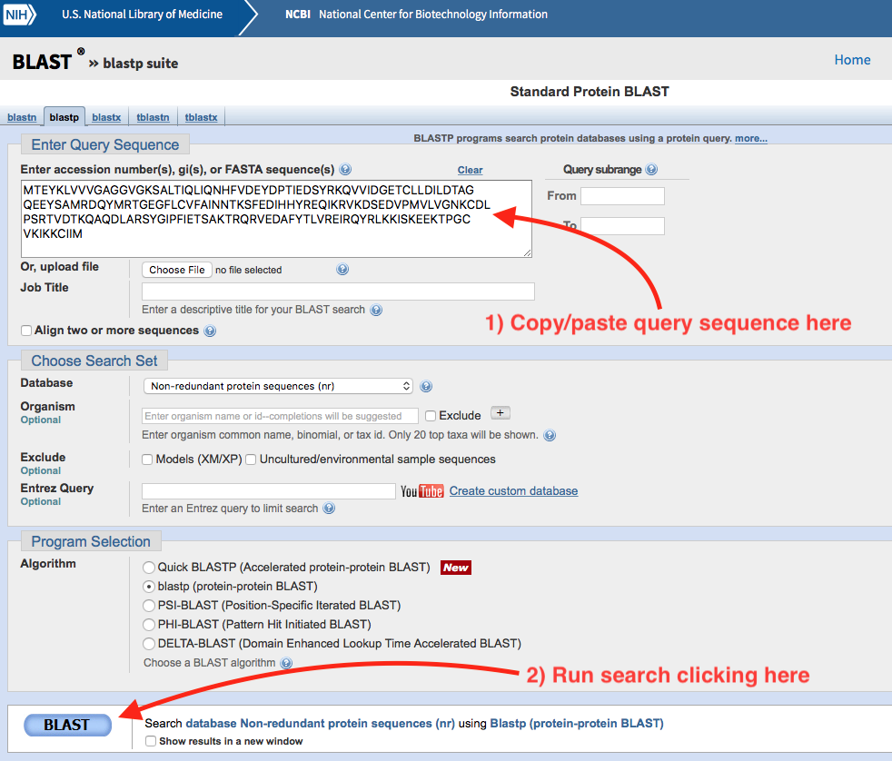
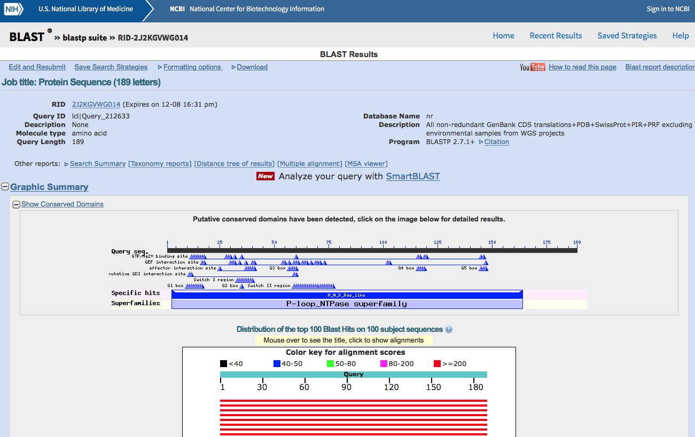
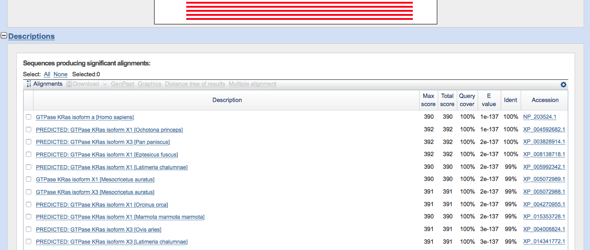

# Sequence analysis

This chapter introduces the basics of sequence analysis methods. As mentioned in Section \@ref(intro-sequence-analysis) ([Sequence analysis](intro-sequence-analysis)), the main goal of sequence analysis is two answer questions regarding DNA, RNA and/or protein sequences. For example, we could be presented with an unknown sequence, like the one shown here:

```
MTEYKLVVVGAGGVGKSALTIQLIQNHFVDEYDPTIEDSYRKQVVIDGETCLLDILDTAG
QEEYSAMRDQYMRTGEGFLCVFAINNTKSFEDIHHYREQIKRVKDSEDVPMVLVGNKCDL
PSRTVDTKQAQDLARSYGIPFIETSAKTRQRVEDAFYTLVREIRQYRLKKISKEEKTPGC
VKIKKCIIM
```

Since we only have the amino acid sequence, the first thing we may want to do is to compare these sequence with the sequence of other proteins in order to see whether we find other proteins that look similar. The process of comparing two sequences to figure out their similarity is called sequence alignment.

## Pairwise alignment

Imagine we could find a known protein for which 100% of its amino acid sequence is identical with our unknown sequence. Then we could say we have identified our protein! Imagine however that not all the amino acids are exactly identical. At some positions we may have some changes. The more changes we have, the more disimilar the two sequences will be. We want a way to quantitatively measure how much different (or similar) two sequences are. This is represented below by the two DNA sequences (seq1 and seq2) which are put together. The sequence of dots and asteriks below indicates whether the two aminoacids aligned are identical (and then is a `.`) or different (and then is a `*`).

```
seq1 A A G G A T G A
seq2 A A C G A T A A
     . . * . . . * .
```

It is possible for the sequences to not be the same lengths. In that situation the residue positions not matching to any other residue in the other sequence are indicated with the gap symbol `-`. Gaps, however, may appear also when comparing sequences of the same length.

```
seq3 A A G G A T G G A
seq2 A A C G A T A - A
     . . * . . . * * .
```

When aligning two sequences we need to specify a scoring system. This is a matrix with a score proportional to the probability of the change in residue happening. A simple scoring system could be the following: +1 when the two residues are the same, -1 otherwise:

```{r, echo=FALSE, comment=NA}
r <- c("A", "G", "T", "C")
m <- matrix(-1, ncol = 4, nrow = 4, dimnames = list(r, r))
diag(m) <- 1
m
```

If we consider this scoring system, the score of the following alignment can be calculated using the information in the scoring matrix. In the following example `+` indicates the +1 score and `-` the -1 score.

```
seq1 A A G G A T G A 
seq2 A A C G A T A A
     + + - + + + - +

score: 6 * (+1) + 2 * (-1) = +4
```

When there are gaps, a score for the gap needs to be specified. For example, we could use a score of -1 and the score of the gapped alignment above can be computed accordingly.

```
seq3 A A G G A T G G A
seq2 A A C G A T A - A
     + + - + + + - - +

score: 6 * (+1) + 3 * (-1) = +3
```

Different alignments will produce different scores. For example, we could have aligned the `seq3` and `seq2` in a different way.

```
seq3 A A G G A T G G A
seq2 A A C G A T A A -
     + + - + + + - - -

score: 5 * (+1) + 4 * (-1) = +1
```

This alignment produces a smaller score and therefore is not as optimal as the original one. The goal of sequence alignment algorithms is to find the optimal alignment, that is, the aligment that maximizes the score. It is important to notice that sometimes there is *best* alignment. For example, consider this alternative alignment.

```
seq3 A A G G A T G G A
seq2 A A C G A T - A A
     + + - + + + - - +

score: 6 * (+1) + 3 * (-1) = +3
```

There is a slight difference in where the second-to-last `A` in `seq2` is located. Both alternatives produce the same score, so there is no way to know which one is the best.

There are two main methods to perform sequence alignment: global and local. In global alignment the two sequences are aligned along their entire lengths, and the best alignment is returned. This means every residue of a sequence is aligned to a residue of the other sequence or to a gap. In local alignment the best subsequence alignment is found. Global alignment is used to compare two sequences end-to-end, whereas local alignment is used to identify the parts of the sequences that are most similar.


For example, using the scoring system above, we can compute the result from global and local aligment for `seq2` and `seq3` using the Biostrings package in Bioconductor:

```{r, echo=FALSE, comment=NA}
Biostrings::pairwiseAlignment(
  "AAGGATGGA",
  "AACGATAA",
  type = "global",
  substitutionMatrix = m,
  gapOpening = 1,
  gapExtension = 0
  )
Biostrings::pairwiseAlignment(
  "AAGGATGGA",
  "AACGATAA",
  type = "local",
  substitutionMatrix = m,
  gapOpening = 1,
  gapExtension = 0
  )
```

Global aligment is alse called [Needleman-Wunsch](https://en.wikipedia.org/wiki/Needleman–Wunsch_algorithm) whereas local aligment is called [Smith-Waterman](https://en.wikipedia.org/wiki/Smith–Waterman_algorithm). You can see more details regarding how these two algorithms work in their wikipedia pages, or in the excellent O'Reilly book [BLAST: An essential guide to the Basic Local Alignment Search Tool]. A more advanced book on the topic of sequence aligment is [Biological sequence analysis: Probabilistic models of proteins and nucleic acids].

## Scoring matrices

In reality we do not use a scoring matrix like the one above. We want to use scoring matrices that reflect how residues (whether amino acid or nucleotide) change in nature. For protein sequences there are two main types of matrices used in sequence aligments: BLOSUM and PAM. I will briefly describe BLOSUM matrices here.

BLOSUM stands for BLOcks SUbstitution Matrix. BLOSUM matrices are empirical, derived from local aligment of protein sequenes found in databases (originally in the BLOCKS database). The matrix number indicates the selection process for including sequences into the computatiom. For example, the BLOSUM62 matrix includes aligments of sequences with less than 62% similarity. Here you can see a fragment of the BLOSUM62 matrix.

```{r, echo=FALSE, comment=NA}
data("BLOSUM62", package = "Biostrings")
BLOSUM62[1:10, 1:10]
```

As you can see the diagonal contains positive scores (e.g. A->A score 4), indicating that identity is highly favored. Not all scores in the diagonal are equal. This reflects that some identities are more strongly enforced that others. For example, the score for D->D is 6, indicating that this identity happens more frequently than A->A. This probably reflect the fact that an A can be replaced by more amino acids without causing a big disruption in the structure than if the change involves a D. Some of the positions are 0, and some others are negative, indicating non-favorable substitutions. For example, the change E->C has a score of -4 indicating that it doesn't happen often, probably because is not favored.

## Blast

Searching for similar sequences in a large sequence database can be computationally expensive because the SW algorithm is relativelly slow. Therefore, some alternatives using heuristics have been developed over the years. One such alternative is [Blast](https://en.wikipedia.org/wiki/BLAST). Blast stands for Basic Local Alignment Tool. Blast uses some heuristics to improve the speed of the local alignment and therefore can be used to search for large sequence databases. Often the quality of the alignment is as good as the one we could obtain with SW, however, it is possible to loose some accuracy. The [NCBI Blast](https://www.ncbi.nlm.nih.gov/BLAST) web server can be used to search for sequence similarity against a wide range of sequence databases hosted at NCBI. Blast searches are also available at many other sequence database resources like [EnsEMBL](https://www.ensembl.org/Multi/Tools/Blast?db=core) and [Uniprot](http://www.uniprot.org/blast/).

For example, we can use the NCBI Blast service to identify our unknown sequence at the begining of this chapter. Go [there](https://www.ncbi.nlm.nih.gov/BLAST) and click on `Protein BLAST`. A web form will show. Copy/paste our unknown sequence on the textbox saying *Enter accession number(s), gi(s), or FASTA sequence(s)*. Click the blue rounded button saying *BLAST*. Wait a few seconds (or minutes depending on the network load) for the result page to show.

```{r, echo=FALSE, fig.cap="Standard Protein Blast submit form."}

```

The result page will look something like this.

```{r, echo=FALSE, fig.cap="Standard Protein Blast result page (top)."}

```


```{r, echo=FALSE, fig.cap="Standard Protein Blast result page (hit list)."}

```

We can see from this list that the first hit is the human GTPase KRas. This is reassuring since that is indeed the sequence I downloaded ([from Uniprot](http://www.uniprot.org/uniprot/P01116)) and included at the beginning of this chapter.


## Multiple sequence alignment

When we want to align 3 o more sequences together we have a multiple sequence alignment (MSA). In a MSA there is more ambiguity about what determines a correct alignment. Also, finding the *best* aligment in terms of scoring scheme is more computationally expensive. Therefore, MSA software uses heuristics to find good but often sub-optimal solutions. Here you can see a MSA of four sequences, members of the Ras family. Three of them correspond to human sequences, the last one to mouse RASH.

```{r, echo=FALSE, fig.cap="Multiple sequence aligment of RAS protein family members."}
knitr::include_graphics("pic/msa.pdf")
```


Software for MSA:

* MAFFT
* Clustal (Classic)
* MUSCLE

## Tree methods

Sequence aligment methods give us information about the similarity between different sequences. Some sequences are more similar to one another than to other sequences. Although this information is somwhat visible in the MSA, it is difficult to visualize complex similarity relationships when many sequences are considered. To help with this problem tree visualization methods can be useful. Tree methods use a distance matrix, e.g. derived from pairwise sequence aligment of a set of sequences, and constructs a binary tree in which proteins closer in the tree are more similar. For example, take a look at the tree shown in Figure \@ref(fig:tree-ras) for the 4 RAS proteins.

```{r tree-ras, echo=FALSE, fig.cap="Phylogenetic tree of 4 RAS proteins."}
knitr::include_graphics("pic/tree_ras.pdf")
```

## Domains and motifs

Biological sequences contain regions of high similarity to other similar regions in other proteins. Sometimes this regios are small, accounting for a few aminoacids, and they are typically named *motifs*. In other cases the conserved regions are larger, and then are called *domains*. Domains are sometimes associated with some structurally motivated definition of domain. Sometimes however, the distinction between these two types of conserved regions is ambigous.

Motifs and domains can be identified as those conserved regions in a MSA. This information then can be encoded into a *Position Specific Scoring Matrix* (PSSM), also called *Position Weight Matrix* (PWM). PSSMs contain information about how likely a particular residue is to be found at a particular position. Therefore, unlike substitution matrices, PSSMs are typically not square or symmetric. Here is the PSSM of the binding motif for the mouse Stat3 transcription factor, obtained from the [Jaspar] database.

```
>MA0144.1 Stat3
  20  13  38   6 321   8   6 585 606 191
  19  10 552 541  21   0   2  21   1  15
  25 129   9   1 148 605 592   7   5 393
 549 461  14  65 123   0  13   0   1  14
```

This matrix represents a motif 10 residues length. It is a DNA motif so the number of rows is four, representing respectivelly `A`, `C`, `G` and `T`. Each column sums up to 613. This means that we started with a 10 residues length MSA containing 613 sequences. At each position we count the number of times a particular letter appears. For example in the first position `T` happens 549 times. This form of the motif is also called *Position Count Matrix* or PCM, because it shows the actual counts. We can transform into frequencies by dividing each column by the total number of counts (613 in this case). We obtain then a *Position Frequency Matrix* or PFM.

```{r, echo=FALSE, comment=NA}
# Don't show for now.
m <- read.table(text = "20  13  38   6 321   8   6 585 606 191
  19  10 552 541  21   0   2  21   1  15
  25 129   9   1 148 605 592   7   5 393
 549 461  14  65 123   0  13   0   1  14")
m <- unname(as.matrix(m))
sweep(m, 2, colSums(m), "/")
```

This information can also be represented using *Sequence Logos*. In this approach we plot at each position all the letters, with each letter height proportional to the probability (In reality it is proportional not to the probability directly but to the information content or *bits*). For example here is the sequence logo for Stat3. You can see that the letters at position 5 are all small. This is because the probabilities are more uniform. There is no clear residue dominating the binding at that position. So we have less information about what residue should be in that position.


```{r, echo=FALSE, message=FALSE, comment=NA}
library(MotifDb)
library(ggplot2)
library(ggseqlogo)
motif <- query(MotifDb, "MA0144.1")[[1]]
ggplot() + geom_logo(motif) + theme_logo()
```

PSSM are commonly used to encode the binding motifs of transcription factors, and this information is collected in databases like [Jaspar]. Then tools like [MEME] can be used to identify the binding sites of transcription factors in the genome.

PSSMs are also used in a variant of Blast called PSI-BLAST. Basically PSI-BLAST performs a round of Blast, then construct at PSSM from a MSA of the best hits, then use this PSSM to iterativelly search the same database, refining the PSSM each cycle with the best hits. This approach results in improved sensitivity.

A similar approach is followed in the [Pfam] database. In Pfam MSAs containing the domain of interest are manually curated (also known as *seed alignments*). These alignments are used to train a Hidden Markov Model (HMM) that learns how to recognize the same domain in other sequences. With this HMM, we can identify all sequences in a database containing that particular domain. HMM models are learned using the software [HMMER].

## Phylogenetics

Biological sequences with a commoen evolutionary origin are called homologs. Homolog sequences found in different species are called orthologs. Homologs within the same species (i.e. originated by e.g. a gene duplication event) are called paralogs. Because of the shared ancestry homologs share similarity at the sequence level. The closer homologs, i.e. the less time has passed since the two sequences diverged, the more similar the two sequences will be. Therefore, sequence similarity is often used as evidence for homology, i.e. common ancestry. Here we do not get into the problem of phylogenies but a good starting point is the classic [Molecular evolution and phylogenetics] by M. Nei, creator of the popular Neighbor-Joining method for tree reconstruction.
