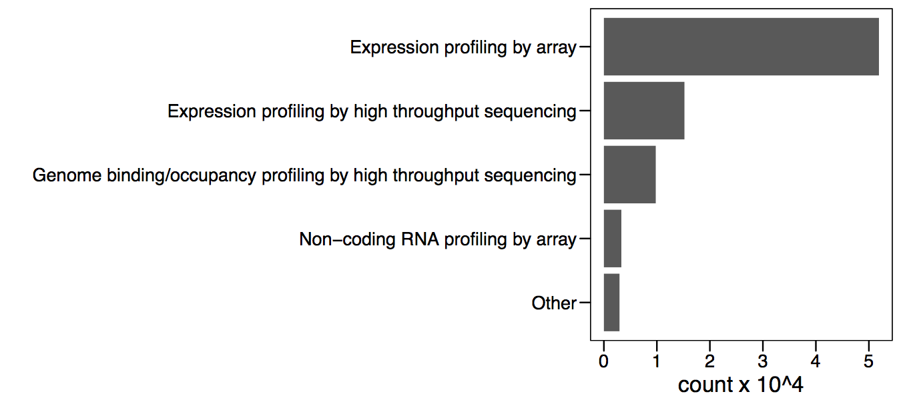

# Omics analysis

This chapter gives a brief introduction on the most common omics technologies.

## Introduction

## Microarrays

Microarrays were arguably the first of the “omics” technologies, starting a new generation of high-throughput analyses. This type of exploratory analysis enables the generation of new hypotheses that can be further tested, becoming one important source of knowledge discovery. Microarrays were the first technology to allow this and currently there is a wealth of experimental data available in public databases. There are over 50,000 samples for expression microarrays deposited in the NCBI gene expression omnibus (Figure \@ref(fig:geo)).

```{r geo, echo=FALSE, fig.cap="Number of submissions per year for various technologies."}

```


Microarrays are basically made of a solid surface with short oligonucleotides attached to it (see Figure \@ref(fig:microarray)). Each oligonucleotide has a specific sequence, complementary to a particular gene transcript. This makes the oligonucleotide a probe for the expression level of the target transcript. The solid surface is divided into regions forming an array. Each region has attached the same oligonucleotide and therefore measures the expression of a single transcript.

```{r microarray, echo=FALSE, fig.cap="Microarrays are made of oligonucleotide probes attached to a solid surface."}
knitr::include_graphics("pic/microarray.png")
```


Here we can see a typical microarray experiment protocol in more detail (Figure \@ref(fig:microarray-workflow)). The RNA extracted from the target cells is converted into cDNA using nucleotides with a fluorescence molecule attached. A hybridization reaction is performed to allow the labelled cDNA to bind to its complementary probes. The location of the hybridized probes is revealed by exciting the array with a laser. Only those regions with cDNA bound will emit fluorescence upon stimulation with the laser. Because the location and sequence of the oligonucleotides are known, the location of the fluorescence will tell us which transcript has been detected. Image analysis is performed to quantify the signal associated with each probe, obtaining an estimate of the transcript’s expression level. Analysis of the raw data involves preprocessing of the intensities (usually background correction and normalization) and statistical analysis. Variants of this basic protocol exist that use different labeling approaches, detection methods, amplification of original RNA, etc.

```{r microarray-workflow, echo=FALSE, fig.cap="Summary of typical microarray workflow."}
knitr::include_graphics("pic/microarray_workflow.png")
```

## Next-generation sequencing

An important limitation of microarrays is that they are based on oligonucleotide probes for detecting expression. This means microarrays can only detect molecules for which a probe exists in the array. The probes in a microarray are based on our knowledge of the genome's sequence at the time of microarray design. Because our knowledge is not perfect, microarrays often contain probes measuring things different to what were originally intended. This may lead to incorrect conclusions if the information about the most likely target sequence is not up to date.
Instead of using a probe to quantify the presence of a DNA or RNA molecule, why not just sequence the molecule? The problem was that existing sequencing technology was slow and expensive. This motivated the development of so called next generation technologies, or NGS.


Let’s look into the fundamental concept behind all NGS technologies from the perspective of transcriptomics (Figure \@ref(fig:ngs)). Imagine this gene containing one intron and both 5’ and 3’ UTRs, and is transcribed into a messenger RNA. The RNA is extracted from the cell and converted into cDNA. This cDNA is used in microarray technology for the hybridization reaction. In NGS however, the cDNA is ligated to sequencing primers, and sequencing produces a set of short reads. Then, this reads are mapped back using sequence alignment, to some reference genome. The location and number of reads will reveal, after correcting from biases like sequencing depth and transcript length, which genes are being expressed and their abundance levels. There are many applications of NGS technologies. Next we will review two of the most popular.

```{r ngs, echo=FALSE, fig.cap="Summary of rationale behind NGS technologies."}
knitr::include_graphics("pic/ngs.png")
```

The most popular application of NGS technologies is RNA-seq, a technology to measure the transcriptome (Figure \@ref(fig:ngs-workflow)). This slide shows a summary of the typical RNA-seq protocol.
•	Isolate and fragment the RNA.
•	A sequencing library is generated by converting the fragmented molecules into double stranded cDNA and ligating sequencing primers to the ends. 
•	The cDNA library is sequenced, resulting in a lot of oligonucleotide sequences called "reads".
•	The reads are aligned to a reference genome. The coverage at each genome location is defined as the number of overlapping reads. This density is proportional to the original molecule’s concentration. Therefore, molecules found at higher concentrations will show larger "peaks".
•	Then computational methods are used to quantify the peaks overlapping gene sequences. Statistical methods are used to identify genes with differences in expression level.
Because we are not limited to pre-specified sequence probes we can use the NGS data to detect the expression of alternative splice variants, non-coding RNAs, genetic variants (or SNPs) and even the expression of uncharacterized transcripts. Also, if the reference genome information is updated, the original data can be realigned, never becoming obsolete and possibly revealing additional information. This versatility increases dramatically the amount of information that can be obtained from a single experiment, making RNA-seq one of the most widely used omics technologies.

```{r ngs-workflow, echo=FALSE, fig.cap="Summary of typical NGS workflow."}
knitr::include_graphics("pic/ngs_workflow.png")
```

### Example: Stat3 expression in macrophages exposed to IL10

In the following example we will look into an RNA-seq experiment in more detail. Figure \@ref(fig:stat3-rnaseq-1) shows the mouse Stat3 locus including the exon/intron structure of the different transcripts as yellow boxes and lines. You can see also other genes nearby, like Stat5a. The expression level in resting and IL10 stimulated macrophages is shown as the peaks overlapping with the exons.

```{r stat3-rnaseq-1, echo=FALSE, fig.cap="Expression of Stat3 in macrophages exposed to IL10."}
knitr::include_graphics("pic/stat3_rnaseq_1.png")
```

Those peaks represent the density of reads mapping to the genome (Figure \@ref(fig:stat3-rnaseq-2)). The expression level can be computed from the area of the peaks. Here we see that the expression level of Stat3 is increased in IL10 treated macrophages. From this picture we can also see some of the difficulties found when interpreting this type of data. For example, which of all the Stat3 transcripts are expressed and which are regulated? Answering this question requires more sophisticated analysis and possibly additional experiments designed specifically to gather supporting evidence.

```{r stat3-rnaseq-2, echo=FALSE, fig.cap="Expression of Stat3 in macrophages exposed to IL10."}

```

In Figure \@ref(fig:stat3-rnaseq-3) we can see more details for one of the samples, with the coverage and the aligned reads below. These dense grey boxes are the actual sequenced reads.

```{r stat3-rnaseq-3, echo=FALSE, fig.cap="Expression of Stat3 in macrophages exposed to IL10."}
knitr::include_graphics("pic/stat3_rnaseq_3.png")
```

Let’s take a closer look to this region near the first exon (Figure \@ref(fig:stat3-rnaseq-4)). You can see here this boxes indicating the length of the reads and the arrowed end the strand to which they align. If we take an even closer look we can see now the reads in more detail. From this picture you can verify that the coverage is the number of reads overlapping at each genomic location. Here the grey boxes indicate that the read sequence matches that of the reference genome to which they have been aligned. Some of these reads locations, however, show mismatches. These are probably sequencing errors, but if a location shows a mismatch consistently found in all reads it will suggest a SNP in the assayed specimen compared to the reference genome.

```{r stat3-rnaseq-4, echo=FALSE, fig.cap="Expression of Stat3 in macrophages exposed to IL10."}
knitr::include_graphics("pic/stat3_rnaseq_4.png")
```

## Mass spectromics methods

## Single cell omics

