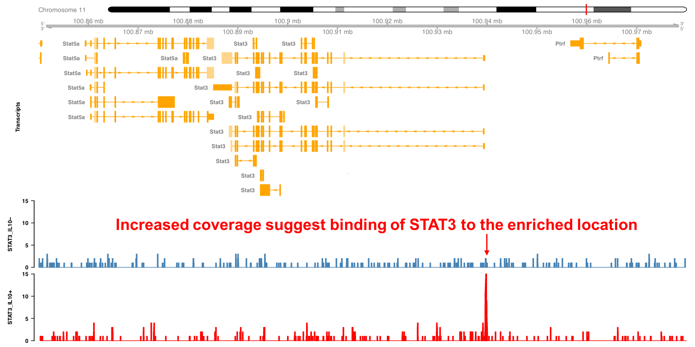

# Omics analysis

This chapter introduces the basics of the most commonly used omics technologies.

## Introduction

What is omics? In the last 20 years there has been an explosion of words ending in ~ome and ~omics in the scientific literature. All these words probably derive from the word genome and genomics. The definition for genome in a classic textbook in Biology says: “Genome is the complete set of genes of an organism”. Genomics, would be the science that studies the genome.

In a similar way, all the RNA molecules expressed in a cell at a particular time is called the *transcriptome*. For all the proteins expressed in a cell we use *proteome*. For all the metabolites we use *metabolome*, and so on. The *ome* word ending is also used to describe the complete set of other things, not necessarily molecules but some kind of property, feature or virtually almost anything. For example, *interactome* may refer to the complete set of protein-protein, protein-DNA and protein-RNA interactions. Extensions of this terminology have resulted in the appearance of terms like *phenome*, *diseasome*, and so on. The technologies used to study *omes* are called *omics*. For example, *transcriptomics* is the field that studies the transcriptome. *Proteomics* is the study of the proteome, etc. This leads to a whole world of omics technologies.

```{r omics-1, echo=FALSE, fig.cap="A world of OMICS technologies."}

```

Let’s look into the basic idea behind one of these technologies and what kind of information they allow us to obtain. For example, in Figure \@ref(fig:omics-2) we can see one cell (the two black circles) before and after exposure to some stimulus. Transcripts are represented by the ribbons, each color being a different transcript. Imagine we are interested on the effect of some chemical on our cells. We hypothesize that the expression level of some genes may be altered by the effect of the stimulus, but we do not know whether this is true or what genes may be altered. We decide to do transcriptomics, or gene expression profiling, to identify which genes are affected. Here we can see the result from such experiment. In this hypothetical scenario gene 1 has two transcripts, but only the first one is downregulated, i.e. its expression is reduced after exposure to the stimulus. Gene 4 has one transcript that is upregulated, i.e. its expression is increased by the stimulus. Other transcripts appear unchanged. The expression level for all transcripts at a given condition is called the expression profile. By comparing expression profiles we can reveal which genes are altered between the different conditions. These are called *differentially expressed genes* (DEGs). One of the goals of transcriptomics is to identify DEGs between different experimental conditions (for example, between control and treatment, patient and disease, etc.).

```{r omics-2, echo=FALSE, fig.cap="Rationale behind OMICS technologies."}

```

Existing omics technologies can be roughly divided into three categories: microarray based, next generation sequencing approaches (or NGS) and mass-spectrometry methods (or MS). We will briefly describe some of these techniques in the following sections.

```{r omics-3, echo=FALSE, fig.cap="Classification of OMICS technologies."}

```

## Microarrays

Microarrays were arguably the first of the “omics” technologies, starting a new generation of high-throughput analyses. This type of exploratory analysis enables the generation of new hypotheses that can be further tested, becoming one important source of knowledge discovery. Microarrays were the first technology to allow this and currently there is a wealth of experimental data available in public databases. There are over 50,000 samples for expression microarrays deposited in the NCBI gene expression omnibus (Figure \@ref(fig:geo)).

```{r geo, echo=FALSE, fig.cap="Number of total submissions for the top 4 technologies."}
knitr::include_graphics("pic/geo_total.pdf")
```

Microarrays are basically made of a solid surface with short oligonucleotides attached to it (see Figure \@ref(fig:microarray)). Each oligonucleotide has a specific sequence, complementary to a particular gene transcript. This makes the oligonucleotide a probe for the expression level of the target transcript. The solid surface is divided into regions forming an array. Each region has attached the same oligonucleotide and therefore can detect the same transcript.

```{r microarray, echo=FALSE, fig.cap="Microarrays are made of oligonucleotide probes attached to a solid surface."}
knitr::include_graphics("pic/microarray.png")
```

Microarrays were initially develop to perform transcriptomics, i.e. study transcription profiles. It was later adapated to study other interesting aspects of Biology, like the binding of transcription factors to the DNA (using ChIP-on-chip) or patterns of human variation (using SNP arrays). Here we will focus on expression microarrays.

In Figure \@ref(fig:microarray-workflow) we can see a typical microarray experiment protocol in more detail. The RNA extracted from the target cells is converted into cDNA using nucleotides with a fluorescence molecule attached. A hybridization reaction is performed to allow the labelled cDNA to bind to its complementary probes in the microarray. The location of the hybridized probes is revealed by exciting the array with a laser (scanning). Only those regions with cDNA bound will emit fluorescence upon stimulation with the laser. Because the location and sequence of the oligonucleotides in the microarray are known, the location of the fluorescence will tell us which transcript has been detected. Image analysis is performed to quantify the signal associated with each probe, obtaining an estimate of the transcript’s expression level. Analysis of the raw data involves preprocessing of the intensities (usually background correction and normalization) and statistical analysis. Variants of this basic protocol exist that use different labeling approaches, detection methods, amplification of original RNA, etc.

```{r microarray-workflow, echo=FALSE, fig.cap="Summary of typical microarray workflow."}
knitr::include_graphics("pic/microarray_workflow.png")
```

## Next-generation sequencing

An important limitation of microarrays is that they are based on oligonucleotide probes for detecting expression. This means microarrays can only detect molecules for which a probe exists in the array. The probes in a microarray are based on our knowledge of the genome's sequence at the time of microarray design. Because our knowledge is not perfect, microarrays often contain probes measuring things different to what were originally intended. This may lead to incorrect conclusions if the information about the most likely target sequence is not up to date. Instead of using a probe to quantify the presence of a DNA or RNA molecule, why not just sequence the molecule? The problem was that existing sequencing technology was slow and expensive. This motivated the development of so called *Next Generation Sequencing* technologies, or NGS.

Let’s look into the fundamental concept behind all NGS technologies from the perspective of transcriptomics (Figure \@ref(fig:ngs)). Imagine this gene containing one intron and both 5’ and 3’ UTRs. The gene is transcribed into a messenger RNA (mRNA). The mRNA is extracted from the cell and converted into cDNA. This cDNA is used in microarray technology for the hybridization reaction. In NGS however, the cDNA is ligated to sequencing primers, and sequencing produces a set of short reads. Then, these reads are mapped back to the genome using sequence alignment. The location and number of reads will reveal, after correcting from biases like sequencing depth and transcript length, which genes are being expressed and their abundance levels. There are many applications of NGS technologies. Next we will review two of the most popular.

```{r ngs, echo=FALSE, fig.cap="Summary of rationale behind NGS technologies."}
knitr::include_graphics("pic/ngs.png")
```

### RNA-seq

The most popular application of NGS technologies is RNA-seq, a technology to measure the transcriptome (Figure \@ref(fig:ngs-rnaseq)). This slide shows a summary of the typical RNA-seq protocol.

1. Isolate and fragment the RNA.

2. A sequencing library is generated by converting the fragmented molecules into double stranded cDNA and ligating sequencing primers to the ends. 

3. The cDNA library is sequenced, resulting in a lot of oligonucleotide sequences called "reads".

4. The reads are aligned to a reference genome. The coverage at each genome location is defined as the number of overlapping reads. This density is proportional to the original molecule’s concentration. Therefore, molecules found at higher concentrations will show larger "peaks".

5. Computational methods are used to quantify the peaks overlapping gene sequences. Statistical methods are used to identify genes with differences in expression level.

Because we are not limited to pre-specified sequence probes we can use the NGS data to detect the expression of alternative splice variants, non-coding RNAs, genetic variants (or SNPs) and even the expression of uncharacterized transcripts. Also, if the reference genome information is updated, the original data can be realigned, never becoming obsolete and possibly revealing additional information. This versatility increases dramatically the amount of information that can be obtained from a single experiment, making RNA-seq one of the most widely used omics technologies.

```{r ngs-rnaseq, echo=FALSE, fig.cap="Summary of typical RNA-seq workflow."}

```

#### Example: Stat3 expression in macrophages exposed to IL10 {-}

In the following example we will look into an RNA-seq experiment in more detail. Figure \@ref(fig:stat3-rnaseq-1) shows the mouse Stat3 locus including the exon/intron structure of the different transcripts as yellow boxes and lines. You can see also other genes nearby, like Stat5a. The expression level in resting and IL10 stimulated macrophages is shown as the peaks overlapping with the exons.

```{r stat3-rnaseq-1, echo=FALSE, fig.cap="Expression of Stat3 in macrophages exposed to IL10."}
knitr::include_graphics("pic/stat3_rnaseq_1.png")
```

Those peaks represent the density of reads mapping to the genome (Figure \@ref(fig:stat3-rnaseq-2)). The expression level can be computed from the area of the peaks. Here we see that the expression level of Stat3 is increased in IL10 treated macrophages. From this picture we can also see some of the difficulties found when interpreting this type of data. For example, which of all the Stat3 transcripts are expressed and which are regulated? Answering this question requires more sophisticated analysis and possibly additional experiments designed specifically to gather supporting evidence.

```{r stat3-rnaseq-2, echo=FALSE, fig.cap="Expression of Stat3 in macrophages exposed to IL10."}
knitr::include_graphics("pic/stat3_rnaseq_2.png")
```

In Figure \@ref(fig:stat3-rnaseq-3) we can see more details for one of the samples, with the coverage and the aligned reads below. These dense grey boxes are the actual sequenced reads.

```{r stat3-rnaseq-3, echo=FALSE, fig.cap="Expression of Stat3 in macrophages exposed to IL10."}
knitr::include_graphics("pic/stat3_rnaseq_3.png")
```

Let’s take a closer look to this region near the first exon (Figure \@ref(fig:stat3-rnaseq-4)). You can see here this boxes indicating the length of the reads and the arrowed end the strand to which they align. If we take an even closer look we can see now the reads in more detail. From this picture you can verify that the coverage is the number of reads overlapping at each genomic location. Here the grey boxes indicate that the read sequence matches that of the reference genome to which they have been aligned. Some of these reads locations, however, show mismatches. These are probably sequencing errors, but if a location shows a mismatch consistently found in all reads it will suggest a SNP in the assayed specimen compared to the reference genome.

```{r stat3-rnaseq-4, echo=FALSE, fig.cap="Expression of Stat3 in macrophages exposed to IL10."}

```

### ChIP-seq

Another popular NGS technology is ChIP-seq, which stands for chromatin immunoprecipitation followed by NGS sequencing. In ChIP-seq we aim to identify protein-DNA interactions. That is, we want to know the sequence of the DNA to which a DNA-binding protein binds. This information is critical to understand gene regulatory programs. For example, gene transcription is regulated by transcription factors that bind to specific regions in the genome, including gene promoters and enhancers. Also, histones represent another type of DNA binding proteins with important roles in the regulation of gene expression. Posttranscriptional histone modifications, like acetylation, methylation, and others, are associated with regulatory outcomes, like expression activation and repression. ChIP-seq enables to study many of these patterns at genome wide scale.

The basic ChIP-seq protocol is shown in Figure \@ref(fig:ngs-chipseq). First, proteins are fixed to the DNA with, e.g. formaldehyde. Then, the chromatin is fragmented, leading to many small fragments free of proteins and some with proteins bound. Among the later ones, some will be bound to the target protein, that can be a transcription factor or a histone with some particular modification like H3K9me3 (tri-methylation of lysine in position 9 of the histone H3). Next, we use an antibody against the target protein for an immunoprecipitation, which allows us to obtain the proteins and the DNA sequences they are bound to. Then we remove the fixation and isolate the DNA. The rest of the protocol, cDNA library construction and sequencing are performed similarly to RNA-seq. Sequencing will produce sequence reads that can be aligned to the reference genome. The read peaks accumulating in DNA loci will reveal where the target protein was bound. Computational methods are used to identify and quantify the peaks. Statistical analysis will help us determine if there is differential binding between experimental conditions.

```{r ngs-chipseq, echo=FALSE, fig.cap="ChIP-seq workflow."}
knitr::include_graphics("pic/ngs_chipseq.png")
```

#### Example: Stat3 binding in macrophages exposed to IL10 {-}

In the following example we can see an application of ChIP-seq to identify the binding locations of the transcription factor Stat3 in macrophages after exposure to Il10. As before, the Stat3 locus in the mouse genome is shown, together with the coverage for the Stat3 ChIP-seq experiment. We can see that Stat3 binds to its own promoter upon Il10 treatment, suggesting that it regulates its own expression.

```{r stat3-chipseq, echo=FALSE, fig.cap="Stat3 binding profile around the Stat3 locus"}

```

An important limitation of ChIP-seq is that it can only identify binding sites for a single TF or histone modification at a time. Another problem is that in eukaryotes, enhancers can be located far away from the genes they regulate, hampering the assignment of TF binding to target genes. Finally, the observation of protein binding to DNA does not demonstrate its functional relevance, which requires additional functional experiments.

### Other NGS technologies

Other NGS technologies are becoming popular in recent years. For example, TSS-seq and CAGE-seq are technologies that identify the 5’ cap structure of the processed mRNA, revealing the location of active promoters. Other technologies are able to reveal information about the chromatin. Chromatin accessibility can be assayed by means of either DNaseI digestion or by transposase reaction. In both cases the enzymes have a preference to react with open chromatin regions, with regions of close chromatin or protected by the binding of proteins being more resilient. This enables to map open chromatin and even the location of nucleosomes and binding of TFs if enough sequencing depth is performed. Nucleosome location can be more directly assayed by using the Mnase-seq protocol. Finally, the methylation of the DNA can be assayed by bisulfite sequencing.

## Mass spectromics methods

Studying transcriptional regulation is one important part for understanding the cell’s phenotype. But some of the transcribed genes will produce proteins that engage in diverse functions in the cell, including signaling pathways that regulate the cell’s behavior and enzymes that regulate metabolic pathways. Therefore, the other important part to understand the cell’s phenotype are the proteome and metabolome. For studying the proteome mass-spectrometry (or MS) approaches have been fundamental. Here we will focus on the use of MS approaches for proteomics.

MS uses the mass-to-charge ratio to identify and quantify chemical molecules. MS is used not only to quantify protein expression, but also post-translational modifications like phosphorylation or ubiquitination, and protein-protein interactions.

### MS

The general proteomics protocol requires digesting the proteins into fragments (peptides). These will be initially separated by liquid chromatography (LC) coupled to MS. This will lead to peptide separation but identification requires another round of fragmentation followed by MS. Each peptide produces a distinct spectrum, which is compared against a database linking spectra to peptide sequences. The identified peptides are then mapped to a protein database to identify the proteins they came from. The number of mapping peptides will be proportional to the original abundance of the proteins, enabling their quantification.

```{r ms, echo=FALSE, fig.cap="Workflow for MS proteomics."}
knitr::include_graphics("pic/ms.png")
```

### AP-MS

Protein interactions are fundamental in regulating cellular pathways, and they play as well important roles in immunology. To obtain protein-protein interaction information we can use a modified MS protocol called AP-MS (affinity purification followed by MS). Similar to ChIP-seq, the first step is to crosslink interacting proteins together with formaldehyde. Next, we isolate the complexes with an antibody against the target protein, also call the bait. Then, crosslinking is reversed, the proteins are digested and LC-MS/MS performed in the usual way. Mapping the peptides to the proteome will identify which other proteins where interacting with our target protein. AP-MS can only assay the interactome around the target protein. Also, it does not identify direct interactions, but proteins that are part of the same protein complex.

```{r ap-ms, echo=FALSE, fig.cap="Workflow for AP-MS proteomics for identifying protein-protein interactions."}

```

## Single cell omics

So far we have assumed that in each omic experiment we obtain a tissue sample, or perhaps isolate the cell type of interest with FACS and then perform the analysis on the bulk of cells. An experiment performed in this way reveals information about (in the case of transcriptomics) the average expression level of all cells in the bulk. In general, this approach is valid if we believe that most of the cells in the population are similarly and that they behavior is homogeneous.
However, recent evidence shows that even in seemingly homogenous populations, there is substantial heterogeneity in the expression levels of genes and proteins. This is even more dramatic in populations where a few cells are regulated distinctly and initiate changes that will drive future responses. For example, in the lymph node there are many naive T cells but only the ones in contact with their specific antigen will be activated and mature into effector cells. Because the associated changes occur in a very limited number of cells, that information may be lost in the averaging resulting from analyzing bulks of cells. This is the motivation behind the field of single cells omics. The foundation of single cell omics is almost identical to what we have seen so far. The main difference is that these omics technologies are applied to each cell individually, requiring of methods to manipulate and extract the target material from single cells in parallel and efficiently. Another challenge is the analysis of this type of data. The data resulting from single cell omics is multivariate in nature and specialized methods are required for their interpretation.

```{r sc, echo=FALSE, fig.cap="Single cell omics captures the stochastic nature of biological processes"}
knitr::include_graphics("pic/ngs_sc.png")
```

The field of single cell omics is in constant development and new or improved methodologies appear increasingly. For transcriptomics the use of microfluidic reaction chambers enables single cells to be subjected to RNA-seq protocols. Another methodology is Fluorescence based flow cytometry (FBFC), which enables to quantify the amount of proteins using fluorophores attached to antibodies. However, because spectral overlap, the maximum number of proteins that can be measured simultaneously is limited. A modification of this technology known as mass cytometry tags antibodies with rare isotopes and uses mass spectrometry to identify proteins. This technique highly improves the dimensionality by increasing the number of proteins and conditions that can be analyzed simultaneously.


