# Bioinformatics resources

In this chapter some of the most important Bioinformatics resources are described. An attempt to organized them by topic is made, but most of these resources are highly integrated. So, for example, you would thing that to do a Blast search you need to go to the Blast web page. But you can also perform Blast searches from the Uniprot and EnsEMBL web pages, to mention just two. Similarly, most if not all sequence databases link the associated Gene Ontology information to their sequence entries. This high degree of integration might make difficult at first to value the existence of different resources.

## Sequence databases

### NCBI {-}

### EnsEMBL {-}

[EnsEMBL](https://www.ensembl.org) is a database where the genome information about many species is collected with a focus con comparative genomics research.

```{r ensembl-web, echo=FALSE, fig.cap="Screenshot of the EnsEMBL home page at https://www.ensembl.org."}
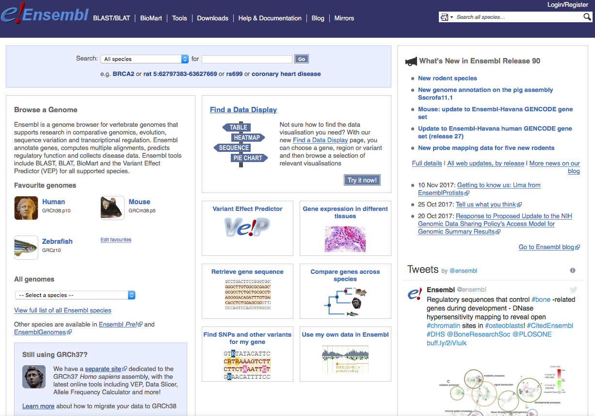
```

### Uniprot {-}

The [Uniprot](http://www.uniprot.org) website focuses on information about protein sequences, including splice forms.

```{r uniprot-web, echo=FALSE, fig.cap="Screenshot of the Uniprot home page at http://www.uniprot.org."}
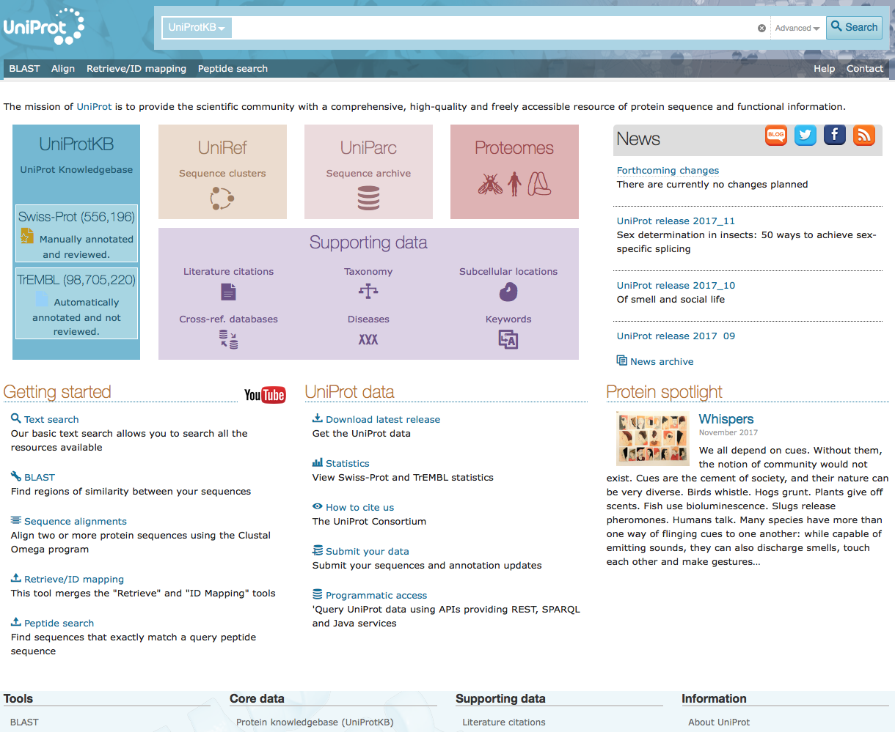
```

## Gene expression databases

### GEO: Gene Expression Omnibus {-}

The [Gene Expression Omnibus (GEO)](https://www.ncbi.nlm.nih.gov/geo/) database collects data from high-throughtput experiments including microarrays and NGS datasets.

```{r geo-web, echo=FALSE, fig.cap="Screenshot of the GEO home page at https://www.ncbi.nlm.nih.gov/geo/."}
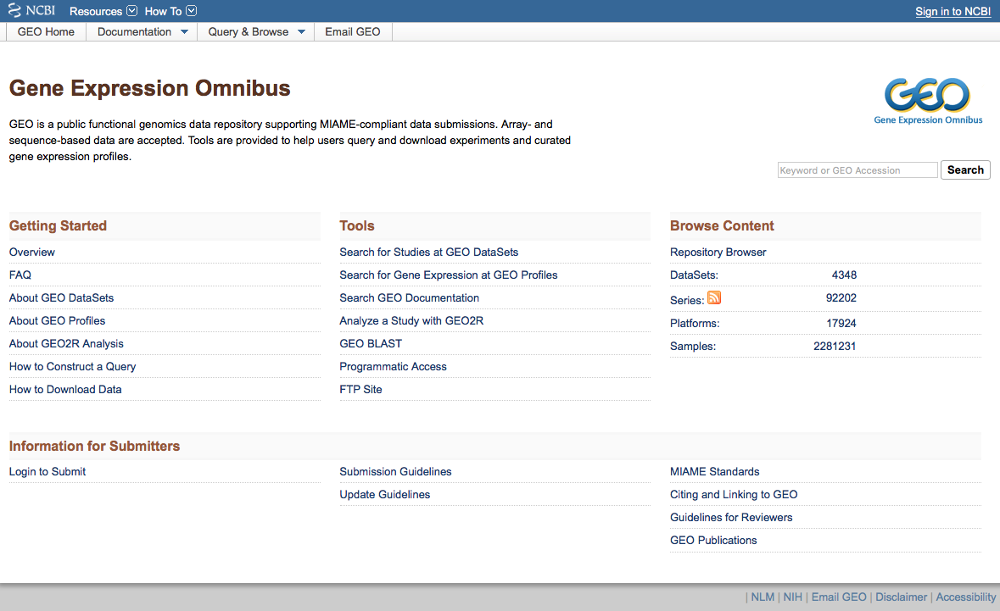
```

The number of submissions per year for microarrays and RNA-seq continues to increase.

```{r geo-year, echo=FALSE, fig.cap="Number of GEO submissions per year for the top 4 technologies."}
knitr::include_graphics("pic/geo_year.pdf")
```

### ArrayExpress {-}

[ArrayExpress](https://www.ebi.ac.uk/arrayexpress/) is the alternative at the European Bioinformatics Institute.

```{r ae-web, echo=FALSE, fig.cap="Screenshot of the ArrayExpress home page at https://www.ebi.ac.uk/arrayexpress/"}
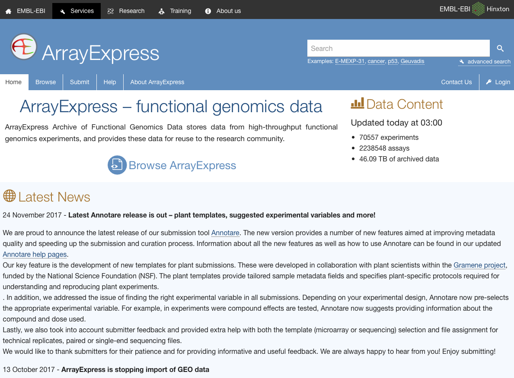
```

## Pathway databases

As information about genes, proteins and metabolites accumulates, it becomes more and more important to organize this knowledge in a comprehensive way. We have mentioned how genes and their products participate in the networks of cellular processes, the cell's pathway. This network includes metabolic, signaling and gene regulatory networks. This information is critical to understand the cell's phenotype, but the accumulated knowledge is daunting. It would benefit to have some central repository with easily accessible tools that enables to visualize existing knowledge in an easy way. It would be also very useful if it was possible to use that information in computer analysis. This is the motivation behind some of the web resources described below.

### KEGG {-}

KEGG stands for [Kyoto Encyclopedia for Genes and Genomes](http://www.kegg.jp) (Figure \@ref(fig:kegg-web)). Is an integrative resource with information about matabolic and signaling pathways in different species, from bacteria and archaea to mammals.

```{r kegg-web, echo=FALSE, fig.cap="Screenshot of the KEGG home page at http://www.kegg.jp."}
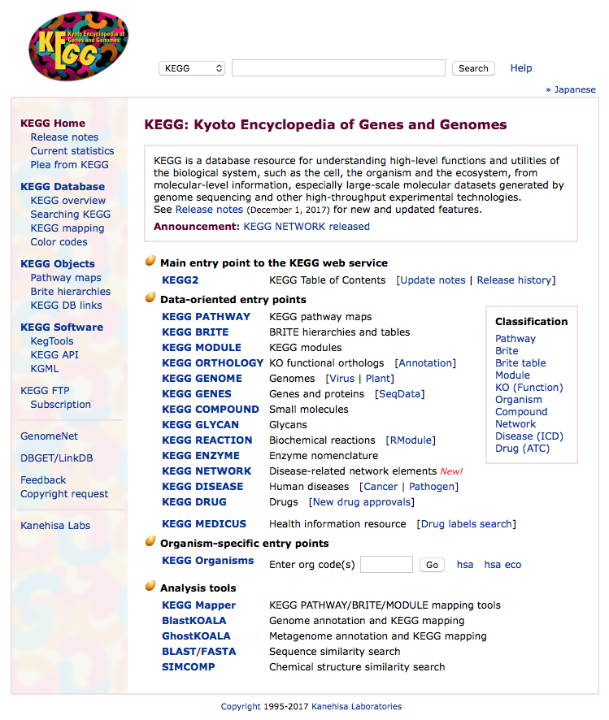
```


### Reactome {-}

## Domain databases

### Pfam {-}

[Pfam](http://pfam.xfam.org) is a database of protein domain families.

>Proteins are generally comprised of one or more functional regions, commonly termed domains. The presence of different domains in varying combinations in different proteins gives rise to the diverse repertoire of proteins found in nature. Identifying the domains present in a protein can provide insights into the function of that protein.
>
>The Pfam database is a large collection of protein domain families. Each family is represented by multiple sequence alignments and a hidden Markov model (HMMs).

```{r pfam-web, echo=FALSE, fig.cap="Screenshot of the Pfam home page at http://pfam.xfam.org."}
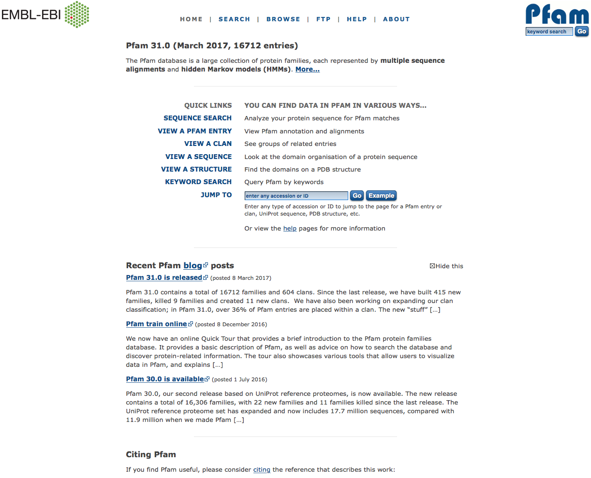
```

## Motif databases

### Jaspar {-}

[Jaspar](http://jaspar.genereg.net) is a database for transcription factor DNA binding motifs.

```{r jaspar-web, echo=FALSE, fig.cap="Screenshot of the Jaspar home page at http://jaspar.genereg.net."}
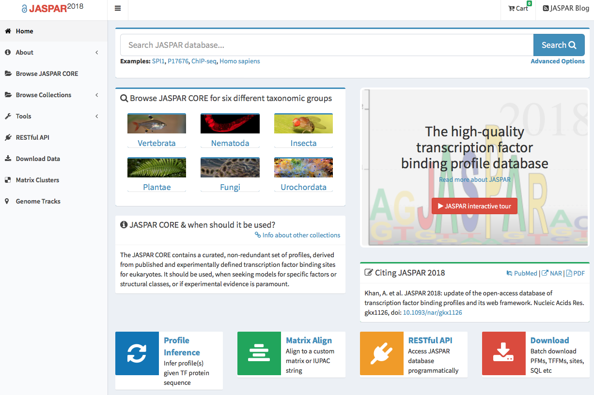
```

## Interaction databases

Information about protein-protein interactions has grown incredibly due to advances in MS in combination with affinity purification methods. There are several databases integrating existing information. Two resources will be highlighted here: BioGRID and STRING.

### BioGRID {-}

[BioGRID](https://thebiogrid.org) focuses on storing information about PPIs for which experimental evidence exists.

```{r biogrid-web, echo=FALSE, fig.cap="Screenshot of the BioGRID home page at https://thebiogrid.org."}

```

### STRING {-}

STRING combines experimental and computational evidence to infer PPIs.

```{r string-web, echo=FALSE, fig.cap="Screenshot of the STRING home page at https://string-db.org."}

```

## Other

### Gene Ontology {-}

One important difficulty when dealing with Biological structures (molecules, organelles, etc.) is the vocabulary we use to described them. As this type of information accumulated different researches would tend to use slighly different ways to describe the same thing. In other cases they can use similar words to describe different things. These nuances make the descriptions often found in publications ambiguous making it difficult to determine the exact meaning of some assertion. This difficulty became more prominent once the amount of information increased dramatically with the advent of omics technologies, and the information about the biological stuff was the subject of computational analyses. There was a need for an standardized nomenclature, and that was the origin of the [Gene Ontology](http://www.geneontology.org) project. The purpose of the Gene Ontology project is stated in it web page:

>The Gene Ontology (GO) project is a major bioinformatics initiative to develop a computational representation of our evolving knowledge of how genes encode biological functions at the molecular, cellular and tissue system levels. Biological systems are so complex that we need to rely on computers to represent this knowledge. The project has developed formal ontologies that represent over 40,000 biological concepts, and are constantly being revised to reflect new discoveries. To date, these concepts have been used to "annotate" gene functions based on experiments reported in over 100,000 peer-reviewed scientific papers.

In particular:

>The Gene Ontology project provides a controlled vocabulary of terms for describing gene product characteristics and gene product annotation data from GO Consortium members, as well as tools to access and process these data.

```{r go-web, echo=FALSE, fig.cap="Screenshot of the Gene Ontology home page at http://www.geneontology.org."}
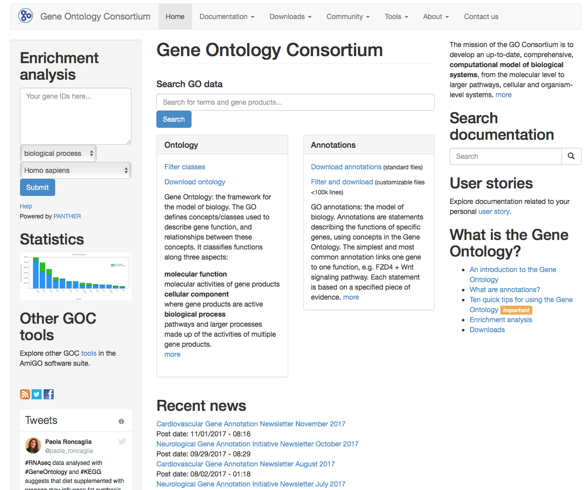
```

## Bioformatics software

### Sequence analysis

#### Blast {-}

The [Blast](https://blast.ncbi.nlm.nih.gov) web page at NCBI is the main point of access to this versitile tool. It can be used to search for sequence similarity against any of the sequence databases at the NCBI.

```{r blast-web, echo=FALSE, fig.cap="Screenshot of the Blast home page at https://blast.ncbi.nlm.nih.gov."}
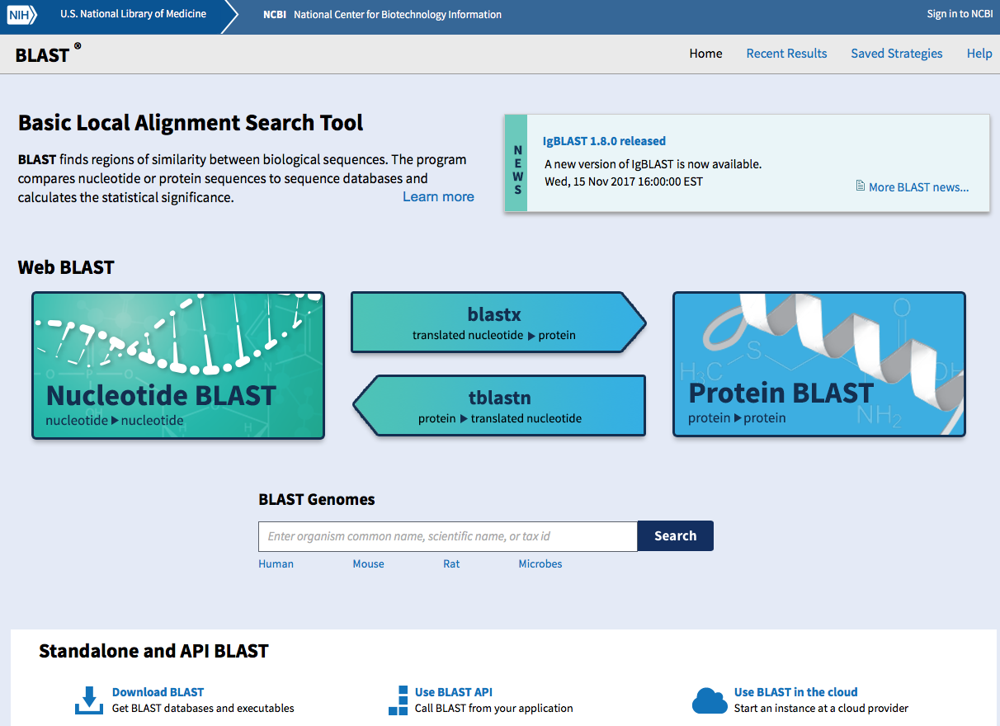
```

#### HMMER {-}

[HMMER](http://hmmer.org) implements Hidden Markov Models for the analysis of biological sequences. It can learn models representing motifs, domains or entire sequences. These models are used to search for sequences matching the models in databases. It can also be used to annotate the domains/motifs present in a sequence using a database of domains. PFAM uses HMMER and manually curated MSA of domains to generate a database of protein families (PFAM). The use of HMM for sequence alignment is described in detail in the excellent book [Biological sequence analysis: Probabilistic models of proteins and nucleic acids].

```{r hmmer-web, echo=FALSE, fig.cap="Screenshot of the Hmmer home page at https://www.ebi.ac.uk/Tools/hmmer."}
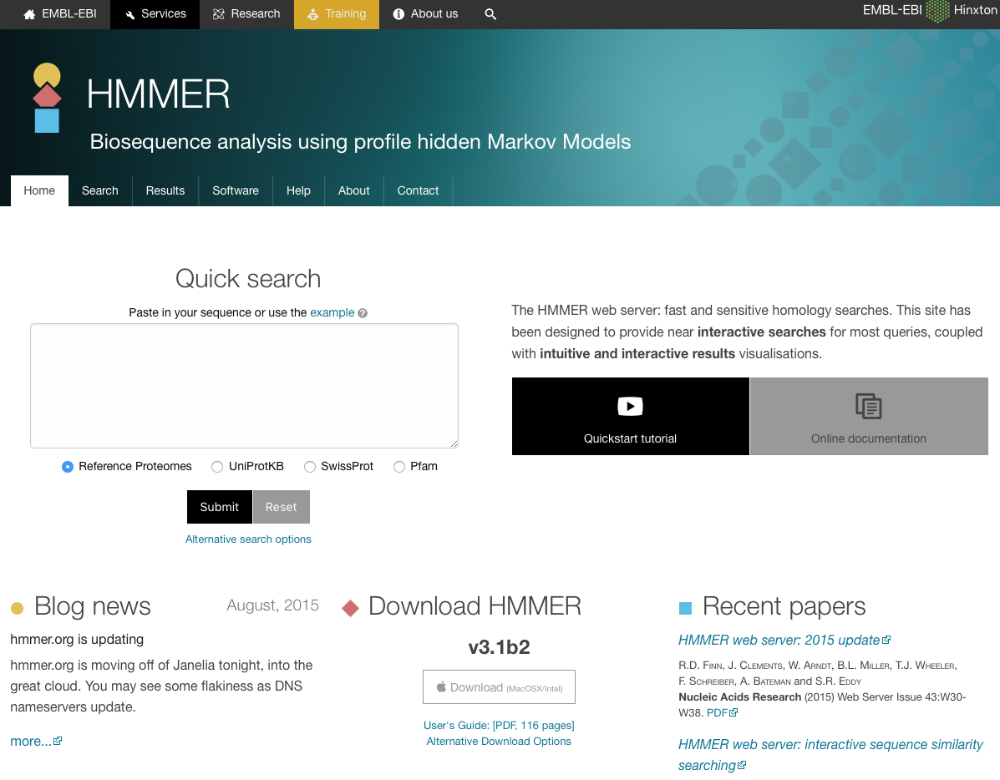
```

#### Jalview {-}

[Jalview](http://www.jalview.org) is a software for sequence analysis. It can visualize sequences, submit them to multiple sequence aligment servers, visualize the resulting MSA, create basic phylogenetic trees and visualize associated structures.

```{r jalview-web, echo=FALSE, fig.cap="Screenshot of the Jalview home page at http://www.jalview.org."}
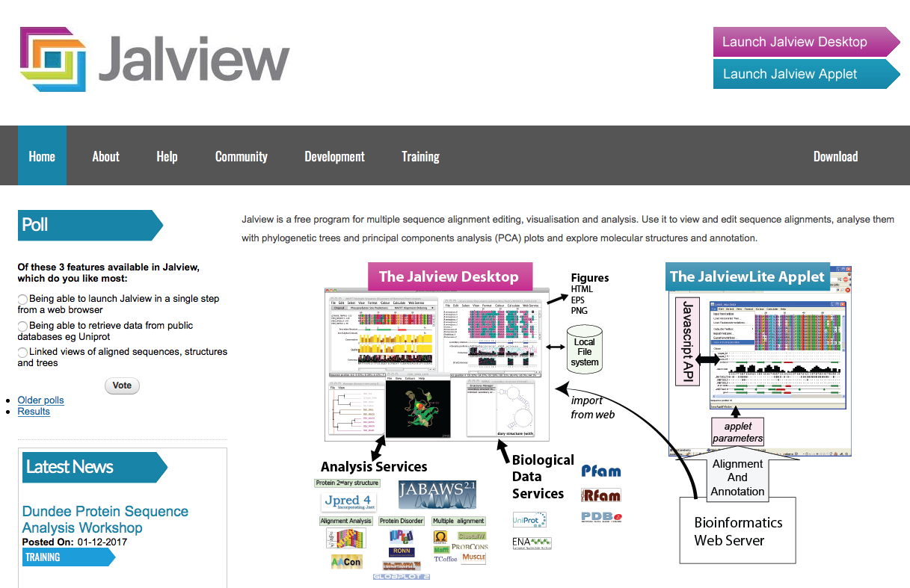
```

#### MEME {-}

The [MEME-suite](http://meme-suite.org) is a collection of tools for the discovery of motifs in proteins, DNA and RNA sequences. If can find de-novo motifs (e.g. MEME) or search for known motifs from a motif database (e.g. MAST, FIMO, etc.)

```{r meme-web, echo=FALSE, fig.cap="Screenshot of the MEME-suite home page at http://meme-suite.org."}
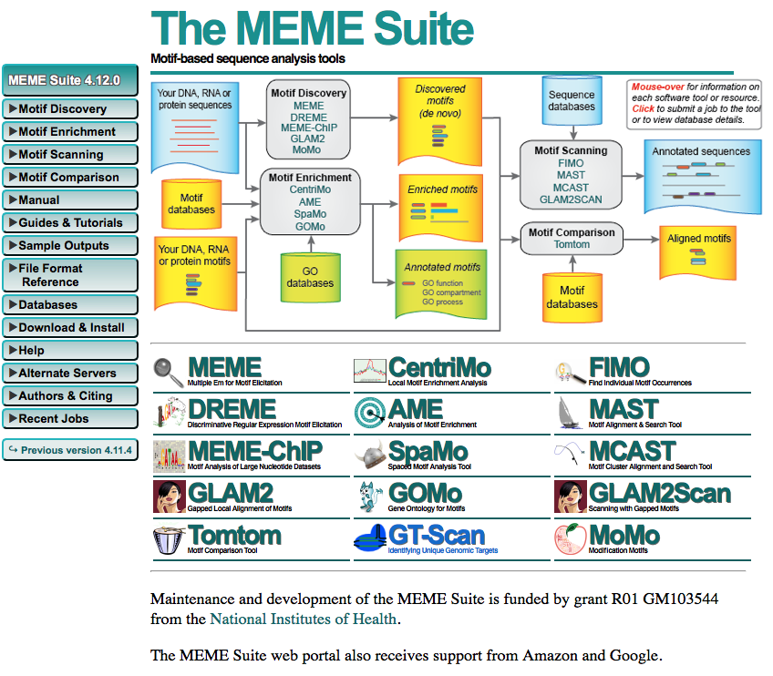
```

### Next generation sequencing

#### Bowtie2 {-}

[Bowtie2](http://bowtie-bio.sourceforge.net/bowtie2/index.shtml) is a command line software to align sequence reads obtained from NGS technologies to a reference genome. It requires sequencing data in [Fastq] format and produces aligments in [SAM] format.

```{r bowtie2-web, echo=FALSE, fig.cap="Screenshot of the Bowtie2 home page at (http://bowtie-bio.sourceforge.net/bowtie2/index.shtml."}
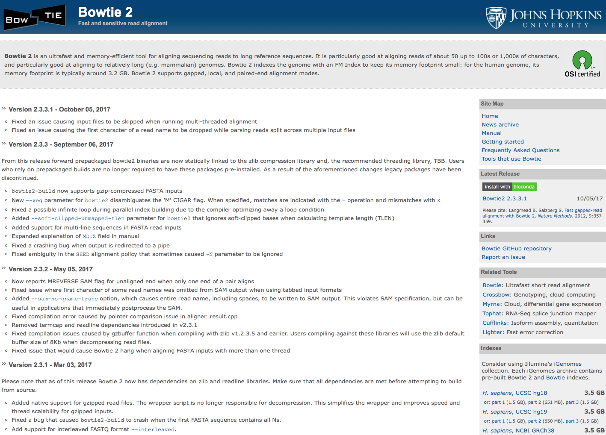
```

#### Samtools {-}

### General frameworks

#### Bioconductor {-}

[Bioconductor](http://www.bioconductor.org) is a project providing R packages for the anlysis of omics datasets in the [R software](https://www.r-project.org). R runs on Windows, Macs and Linux computers.

>Bioconductor provides tools for the analysis and comprehension of high-throughput genomic data. Bioconductor uses the R statistical programming language, and is open source and open development.

```{r bioconductor-web, echo=FALSE, fig.cap="Screenshot of the Bioconductor home page at http://www.bioconductor.org."}

```

#### Cytoscape {-}

[Cytoscape](http://www.cytoscape.org) is a software for the analysis and visualization of networks. It enables to import network information from online databases and integrate it with omics data like for example gene expression profiles. Cytoscape runs on Windows, Macs and Linux computers.

```{r cytoscape-hiv, echo=FALSE, fig.cap="Screenshot of Cytoscape showing the HIV sample dataset http://www.cytoscape.org."}
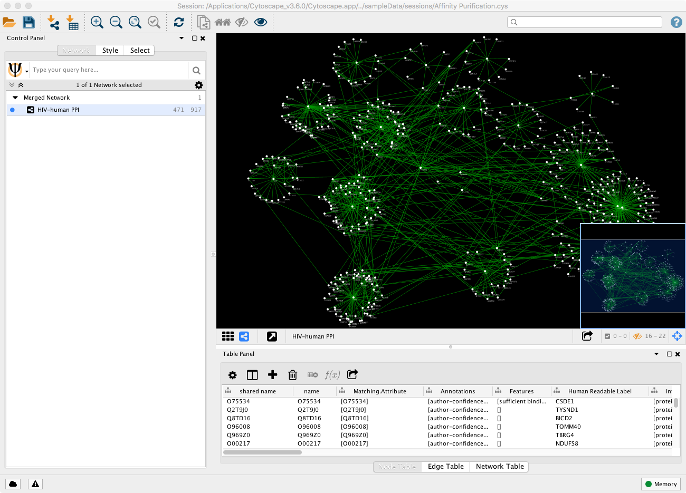
```

#### Galaxy {-}

The [Galaxy](https://galaxyproject.org/tutorials/g101) project provides a web platform for the analysis of NGS data. In their own words:

>Galaxy software framework is an open-source application (distributed under the permissive Academic Free License. Its goal is to develop and maintain a system that enables researchers without informatics expertise to perform computational analyses through the web. A user interacts with Galaxy through the web by uploading and analyzing the data. Galaxy interacts with underlying computational infrastructure (servers that run the analyses and disks that store the data) without exposing it to the user.

```{r gakaxy-web, echo=FALSE, fig.cap="Screenshot of the main Galaxy site at http://usegalaxy.org."}
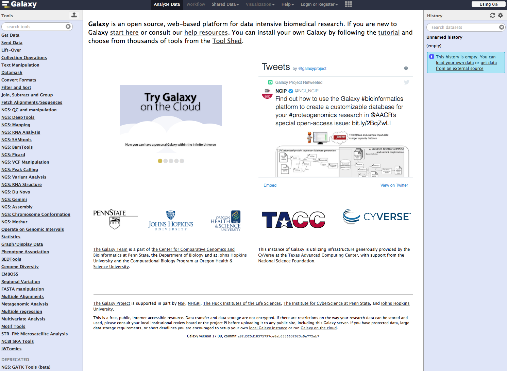
```

## File formats

### FASTA {-}

FASTA is a very simple file format used to store information about biological sequences, including protein, DNA and RNA. Each entry consists of the `>` character followed by a sequence *Id* and a description, separated from the *Id* by a space character. The sequence itself goes in the next lines. Often FASTA files are formatted with a maximum number of residues per line (e.g. 60), which helps when visualizing the information in a regular text editor.

```
>seq1 This is seq1
AGTTAGGATTTGCGCCATT
```

### Fastq {-}

[FASTQ](https://en.wikipedia.org/wiki/FASTQ_format) is a format used to store information from NGS technologies. In particular, stores the sequences of the reads in addition to information about the quality of sequencing. Each entry starts with the `@` character. That line also contains other information like the read identifier. The next line is the sequence information. Next there is a line with the `+` character, and then is the quality information encoded as a [phred score](https://en.wikipedia.org/wiki/Phred_quality_score) of the same length as the sequence.

```
@K00211:114:H52N5BBXX:1:2125:22252:26301
TTCCTATATAATCTTTATTTCTGGAAGTTAAAGTAGTTACAGCAATATACAAAAACAAACAACAACAAAAAACAACCCACAATAATATAAATTTTTACAC
+
AAFFFJJJJJJJJJJJJJJJJJJJJJJJJJJJJJJJJJJJJJJJJJJJJJJJJJJJJJJJJJJJJJJJJJJJJJJJJFJJJJJJJJJJJJJJJJJJJJJJ
```

### SAM {-}
